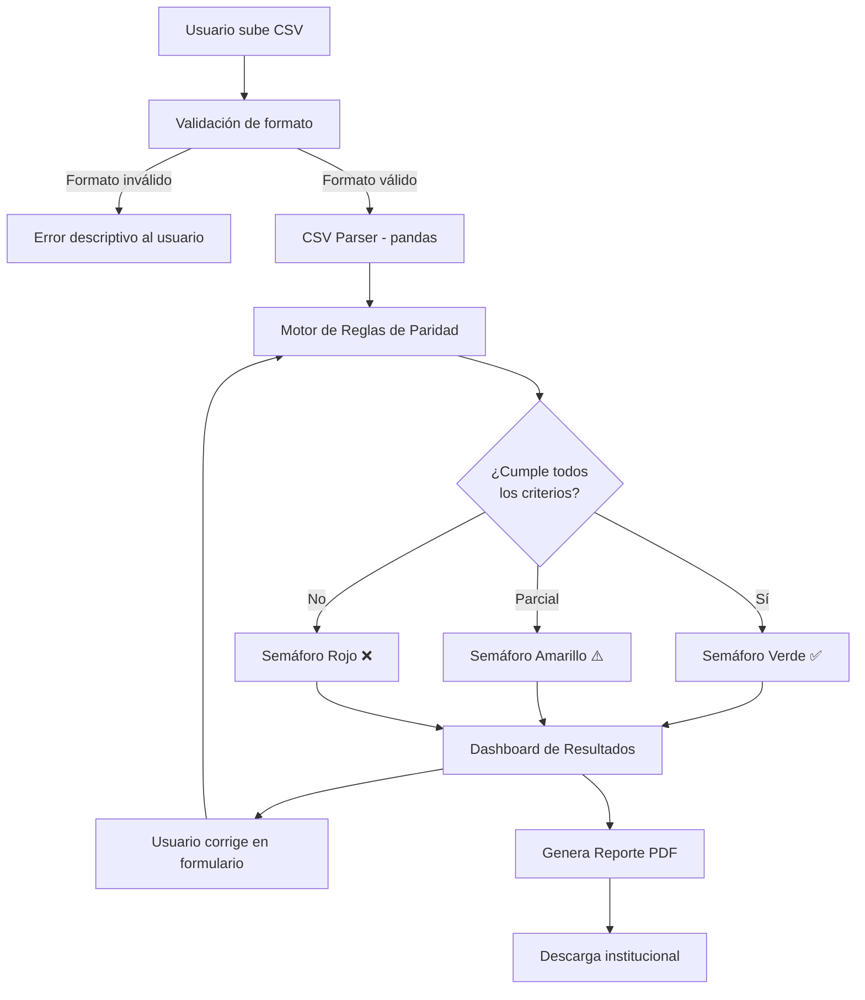

# ⚖️ ParidadCheck

<div align="center">


**Verificación automática de paridad de género y acciones afirmativas en candidaturas electorales**

[](https://python.org)
[](https://fastapi.tiangolo.com)
[](https://react.dev)
[](https://vitejs.dev)
[](https://tailwindcss.com)
[](LICENSE)

---

🏆 **4º Hackathon de Ciberdemocracia — IEE Chihuahua · TEPJF · Tec de Monterrey · Mayo 2026**

**Eje 4:** Registros de candidaturas con paridad y cumplimiento de acciones afirmativas

</div>

---

## 📋 Tabla de Contenidos

- [El Problema](#-el-problema)
- [La Solución](#-la-solución)
- [Demo](#-demo)
- [Arquitectura](#-arquitectura)
- [Paleta de Colores](#-paleta-de-colores)
- [Instalación](#-instalación)
- [Uso](#-uso)
- [Estructura del CSV](#-estructura-del-csv)
- [Output del Sistema](#-output-del-sistema)
- [Legislación Aplicada](#-legislación-aplicada)
- [Equipo](#-equipo)
- [Licencia](#-licencia)

---

## 🔍 El Problema

Cada proceso electoral en México, los institutos electorales y los partidos políticos enfrentan el mismo desafío crítico: **validar manualmente el cumplimiento de paridad de género y acciones afirmativas** en cientos o miles de candidaturas, bajo presión de tiempo y con riesgo alto de error humano.

La legislación electoral mexicana es exigente y multidimensional:

- La **paridad horizontal** exige que en fórmulas propietario-suplente no se concentre un solo género.
- La **paridad vertical** exige que en la lista ordenada por posición, los géneros se alternen de forma equitativa.
- La **paridad transversal** exige que del total de candidaturas postuladas, el 50% corresponda a cada género.
- Las **acciones afirmativas** exigen cuotas específicas para personas indígenas, con discapacidad, jóvenes (18–29 años) y de la diversidad sexual.

Un solo error puede derivar en la **impugnación de toda una lista de candidaturas** ante el TEPJF, generando costos institucionales, retrasos y desconfianza ciudadana.

> **Dato clave:** En el proceso electoral 2020-2021, el TEPJF resolvió más de 30 casos relacionados con incumplimiento de paridad y acciones afirmativas, muchos de ellos por errores detectables con validación automatizada.

---

## 💡 La Solución

**ParidadCheck** es una plataforma web que permite a partidos políticos y autoridades electorales cargar su lista de candidaturas en formato CSV y obtener en segundos:

| Feature | Descripción |
|---|---|
| 🔴🟡🟢 **Semáforo de cumplimiento** | Visualización inmediata por cada criterio de paridad |
| 📊 **Dashboard interactivo** | Tabla de candidaturas con filas marcadas donde hay incumplimiento |
| ⚖️ **Fundamentación legal** | Cada incumplimiento cita el artículo exacto de la ley violada |
| 📄 **Reporte PDF descargable** | Documento institucional listo para presentar ante autoridades |
| ✏️ **Formulario de corrección** | Edición inline sin necesidad de re-subir el CSV |

---

## 🎬 Demo

> 📹 *Demo en vivo disponible durante el hackathón — 15 y 16 de mayo de 2026*

```
[ GIF / VIDEO DEMO AQUÍ ]

Flujo completo:
1. Drag & drop del CSV de candidaturas
2. Preview y validación de formato
3. Procesamiento del motor de reglas (~1 segundo)
4. Dashboard con semáforo de resultados
5. Descarga del reporte PDF institucional
```

---

## 🏗️ Arquitectura

```
┌─────────────────────────────────────────────────────────────────┐
│                        USUARIO FINAL                            │
│              (Partido político / Autoridad electoral)           │
└────────────────────────────┬────────────────────────────────────┘
                             │  Sube CSV de candidaturas
                             ▼
┌─────────────────────────────────────────────────────────────────┐
│                    FRONTEND (React + Vite)                       │
│                                                                  │
│  ┌──────────────┐  ┌──────────────┐  ┌───────────────────────┐  │
│  │  CSV Upload  │  │  Data Table  │  │  Semáforo Dashboard   │  │
│  │  Drag & Drop │  │  + Editor   │  │  + Métricas           │  │
│  └──────┬───────┘  └──────┬───────┘  └──────────┬────────────┘  │
│         │                 │                      │               │
│         └─────────────────┴──────────────────────┘               │
│                           │ HTTP / JSON                          │
└───────────────────────────┼──────────────────────────────────────┘
                            │
                            ▼
┌─────────────────────────────────────────────────────────────────┐
│                   BACKEND (Python + FastAPI)                     │
│                                                                  │
│  ┌─────────────────┐     ┌──────────────────────────────────┐   │
│  │   CSV Parser    │────▶│      Motor de Reglas             │   │
│  │   (pandas)      │     │                                  │   │
│  └─────────────────┘     │  ✓ Paridad horizontal            │   │
│                           │  ✓ Paridad vertical              │   │
│  ┌─────────────────┐     │  ✓ Paridad transversal           │   │
│  │  PDF Generator  │◀────│  ✓ Acciones afirmativas          │   │
│  │  (WeasyPrint)   │     │  ✓ Fundamentación legal          │   │
│  └─────────────────┘     └──────────────────────────────────┘   │
│                                                                  │
│           Todo en memoria — sin base de datos                    │
└─────────────────────────────────────────────────────────────────┘
```

### Diagrama de flujo de datos (Mermaid)



---

## 🎨 Paleta de Colores

La paleta de ParidadCheck combina la **confianza institucional** del contexto electoral mexicano con una estética moderna y accesible.

### Variables CSS (Tailwind config)

```javascript
// tailwind.config.js
module.exports = {
  theme: {
    extend: {
      colors: {
        // PRIMARY — Azul institucional profundo
        // Inspirado en la identidad visual del IEE y el TEPJF.
        // Transmite autoridad, confianza y seriedad democrática
        // sin caer en el azul corporativo genérico.
        primary: {
          50:  '#EEF1F9',
          100: '#D5DCF0',
          500: '#2C4BA3',
          600: '#1B2B5E',  // ← color principal
          700: '#111D42',
          900: '#080D1F',
        },

        // ACCENT — Magenta electoral
        // El magenta/rosa es el color distintivo de los institutos
        // electorales en México (IFE/INE). Usado para CTAs y elementos
        // interactivos. Rompe con lo "aburrido gubernamental".
        accent: {
          400: '#E040A0',
          500: '#C2185B',  // ← color de acento principal
          600: '#880E4F',
        },

        // SUCCESS — Verde validación
        // Verde semáforo para indicar cumplimiento total.
        // Tono más oscuro que el verde genérico para mejor contraste
        // sobre fondos blancos (accesibilidad WCAG AA).
        success: {
          100: '#DCFCE7',
          500: '#16A34A',  // ← semáforo verde
          700: '#15803D',
        },

        // WARNING — Ámbar cumplimiento parcial
        // Para candidaturas con incumplimientos menores o advertencias.
        // Legible sobre fondo claro, no confundible con el rojo.
        warning: {
          100: '#FEF9C3',
          500: '#CA8A04',  // ← semáforo amarillo
          700: '#A16207',
        },

        // DANGER — Rojo incumplimiento
        // Incumplimiento grave de paridad o acciones afirmativas.
        // Rojo sobrio, no alarmista, que mantiene la seriedad institucional.
        danger: {
          100: '#FEE2E2',
          500: '#DC2626',  // ← semáforo rojo
          700: '#B91C1C',
        },

        // NEUTRAL — Escala de grises
        // Para textos, fondos de tabla, bordes y elementos secundarios.
        neutral: {
          50:  '#F8FAFC',
          100: '#F1F5F9',
          200: '#E2E8F0',
          400: '#94A3B8',
          600: '#475569',
          800: '#1E293B',
          900: '#0F172A',
        },
      }
    }
  }
}
```

### Vista previa de tokens

| Token | Hex | Uso |
|---|---|---|
| `primary-600` | `#1B2B5E` | Header, títulos principales, botón primario |
| `accent-500` | `#C2185B` | CTAs secundarios, badges, highlights |
| `success-500` | `#16A34A` | Semáforo verde, checkmarks |
| `warning-500` | `#CA8A04` | Semáforo amarillo, advertencias |
| `danger-500` | `#DC2626` | Semáforo rojo, errores críticos |
| `neutral-50` | `#F8FAFC` | Fondo general de la app |
| `neutral-800` | `#1E293B` | Texto corporal |

---

## 🚀 Instalación

### Prerequisitos

- Node.js 20+
- Python 3.11+
- pip

### Backend (FastAPI)

```bash
# Clonar el repositorio
git clone https://github.com/NexCodeSolutions/paridad-check.git
cd paridad-check

# Crear entorno virtual
python -m venv venv
source venv/bin/activate  # Windows: venv\Scripts\activate

# Instalar dependencias
pip install -r backend/requirements.txt

# Levantar el servidor (desde la raíz del repo)
uvicorn backend.main:app --reload --port 8000
```

> Nota: el backend usa imports absolutos (`from backend.X import ...`),
> por lo que `uvicorn` debe ejecutarse desde la raíz del repo y no desde
> dentro de `backend/`.

El backend estará disponible en: `http://localhost:8000`
Documentación automática (Swagger): `http://localhost:8000/docs`

### Frontend (React + Vite)

```bash
cd paridad-check/frontend

# Instalar dependencias
npm install

# Variables de entorno
cp .env.example .env
# Editar .env: VITE_API_URL=http://localhost:8000

# Levantar el servidor de desarrollo
npm run dev
```

El frontend estará disponible en: `http://localhost:5173`

---

## 📖 Uso

### 1. Preparar el CSV de candidaturas

El archivo debe seguir la estructura definida en la siguiente sección. Descarga el [CSV de ejemplo aquí](./examples/candidaturas_ejemplo.csv).

### 2. Subir el archivo

Arrastra y suelta el CSV en la zona de carga o haz clic en "Seleccionar archivo".

### 3. Revisar y corregir

El sistema mostrará una preview de los datos. Puedes editar candidatos individualmente antes de validar.

### 4. Validar

Haz clic en "Validar Paridad". El motor de reglas procesará el archivo en menos de 1 segundo.

### 5. Interpretar resultados

El dashboard mostrará el semáforo por cada criterio. Las filas con incumplimiento se destacan en rojo con el artículo legal violado.

### 6. Descargar reporte

Haz clic en "Descargar Reporte PDF" para obtener el documento institucional.

---

## 📂 Estructura del CSV

### Columnas requeridas

| Columna | Tipo | Valores permitidos | Descripción |
|---|---|---|---|
| `nombre` | string | Texto libre | Nombre completo del candidato |
| `genero` | string | `M`, `F`, `NB` | Género declarado |
| `partido` | string | Siglas oficiales | Partido que postula |
| `cargo` | string | `diputacion`, `regiduria`, `presidencia` | Cargo al que aspira |
| `tipo` | string | `propietario`, `suplente` | Tipo en la fórmula |
| `posicion` | integer | 1-N | Posición en la lista |
| `distrito` | string | Texto libre | Distrito o municipio |
| `indigena` | boolean | `true`, `false` | Acción afirmativa indígena |
| `discapacidad` | boolean | `true`, `false` | Acción afirmativa discapacidad |
| `fecha_nacimiento` | date | `YYYY-MM-DD` | Para calcular si aplica cuota joven |
| `lgbtq` | boolean | `true`, `false` | Acción afirmativa diversidad sexual |

### Ejemplo de CSV válido

```csv
nombre,genero,partido,cargo,tipo,posicion,distrito,indigena,discapacidad,fecha_nacimiento,lgbtq
Ana Ramírez López,F,PAN,diputacion,propietario,1,Distrito 1,false,false,1990-03-15,false
Carlos Mendoza Ruiz,M,PAN,diputacion,suplente,1,Distrito 1,false,false,1988-07-22,false
Roberto Sánchez Cruz,M,PAN,diputacion,propietario,2,Distrito 2,false,false,1975-11-08,false
María González Pérez,F,PAN,diputacion,suplente,2,Distrito 2,false,false,1995-01-30,false
```

---

## 📊 Output del Sistema

### Semáforo de cumplimiento (JSON)

```json
{
  "partido": "PAN",
  "total_candidaturas": 20,
  "resultado_global": "WARNING",
  "criterios": {
    "paridad_horizontal": {
      "status": "SUCCESS",
      "cumple": true,
      "porcentaje_real": 50.0,
      "porcentaje_requerido": 50.0,
      "articulo": "Art. 232 párrafo 3 LGIPE"
    },
    "paridad_vertical": {
      "status": "DANGER",
      "cumple": false,
      "detalle": "Posiciones 1, 3 y 5 son del mismo género",
      "articulo": "Art. 233 LGIPE — Criterio de alternancia"
    },
    "paridad_transversal": {
      "status": "SUCCESS",
      "cumple": true,
      "mujeres": 10,
      "hombres": 10
    },
    "acciones_afirmativas": {
      "indigenas": { "status": "SUCCESS", "requerido": 1, "registrado": 2 },
      "discapacidad": { "status": "WARNING", "requerido": 1, "registrado": 0 },
      "jovenes": { "status": "SUCCESS", "requerido": 2, "registrado": 3 },
      "lgbtq": { "status": "SUCCESS", "requerido": 1, "registrado": 1 }
    }
  },
  "incumplimientos": [
    {
      "tipo": "paridad_vertical",
      "candidatos_afectados": ["Roberto Sánchez Cruz", "Pedro López García"],
      "descripcion": "Posiciones 3 y 5 son ocupadas por el mismo género sin alternancia",
      "articulo": "Art. 233 LGIPE",
      "sugerencia": "Intercambiar posición 4 (F) con posición 3 (M)"
    }
  ]
}
```

### Reporte PDF

El reporte generado incluye:

- **Portada institucional** con nombre del partido, fecha y folio de validación
- **Resumen ejecutivo** con semáforo general y porcentaje de cumplimiento
- **Tabla de candidaturas** completa con celdas marcadas en rojo/amarillo
- **Detalle de incumplimientos** con artículo legal citado y sugerencia de corrección
- **Firma digital** de validación del sistema

---

## ⚖️ Legislación Aplicada

ParidadCheck valida el cumplimiento de los siguientes ordenamientos:

### Ley General de Instituciones y Procedimientos Electorales (LGIPE)

| Artículo | Contenido | Criterio validado |
|---|---|---|
| Art. 232, párr. 3 | Paridad de género en candidaturas a diputaciones federales | Paridad transversal 50/50 |
| Art. 233 | Alternancia de géneros en listas de representación proporcional | Paridad vertical |
| Art. 234 | Fórmulas integradas por personas del mismo género | Paridad horizontal |

### Ley General de Partidos Políticos (LGPP)

| Artículo | Contenido | Criterio validado |
|---|---|---|
| Art. 3, párr. 5 | Paridad de género como principio rector | Marco general |
| Art. 25, fracc. r | Obligación de postular candidaturas con paridad | Validación por partido |

### Legislación de Chihuahua

| Ordenamiento | Artículo | Criterio |
|---|---|---|
| Código Electoral del Estado de Chihuahua | Art. 218 | Paridad en candidaturas locales |
| Código Electoral del Estado de Chihuahua | Art. 219 | Acciones afirmativas obligatorias |

### Criterios del TEPJF

- **SUP-REC-1410/2021** — Criterio de alternancia estricta en listas RP
- **SUP-REC-0894/2021** — Paridad transversal como requisito de registro
- **SUP-JDC-0304/2020** — Acciones afirmativas para personas indígenas

---

## 👥 Equipo

<table>
  <tr>
    <td align="center"><b>David Domínguez</b><br/>Backend Developer<br/>Python · FastAPI · Motor de Reglas</td>
    <td align="center"><b>Carlos Alvarado</b><br/>Project Lead<br/>Arquitectura · Documentación</td>
    <td align="center"><b>Diego Zamarrón</b><br/>Frontend Developer<br/>React · Tailwind · UI/UX</td>
    <td align="center"><b>Iván López</b><br/>QA Engineer<br/>Testing · Casos de prueba</td>
  </tr>
</table>

**NexCode Solutions S.A. de C.V.**
Instituto Tecnológico de Chihuahua II · Chihuahua, México

---

## 📄 Licencia

```
MIT License

Copyright (c) 2026 NexCode Solutions S.A. de C.V.

Permission is hereby granted, free of charge, to any person obtaining a copy
of this software and associated documentation files (the "Software"), to deal
in the Software without restriction, including without limitation the rights
to use, copy, modify, merge, publish, distribute, sublicense, and/or sell
copies of the Software, and to permit persons to whom the Software is
furnished to do so, subject to the following conditions:

The above copyright notice and this permission notice shall be included in all
copies or substantial portions of the Software.

THE SOFTWARE IS PROVIDED "AS IS", WITHOUT WARRANTY OF ANY KIND, EXPRESS OR
IMPLIED, INCLUDING BUT NOT LIMITED TO THE WARRANTIES OF MERCHANTABILITY,
FITNESS FOR A PARTICULAR PURPOSE AND NONINFRINGEMENT.
```

---

<div align="center">

Desarrollado con ❤️ para fortalecer la democracia en Chihuahua

**4º Hackathon de Ciberdemocracia · IEE Chihuahua · Mayo 2026**

</div>
